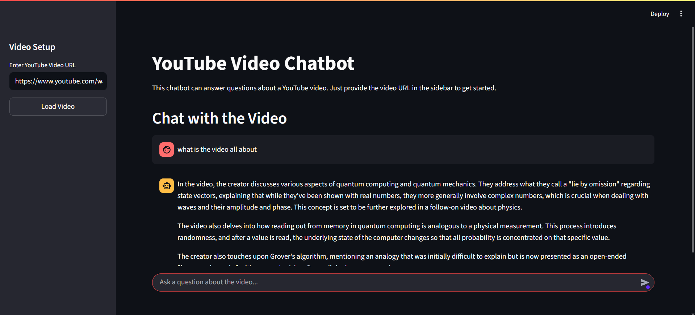

# Ask-Gemini-Video-Edition

An interactive Streamlit app to chat with any YouTube video. Just paste a URL, and ask questions using the power of Google's Gemini AI.



## ✨ Features

- **Easy Video Loading**: Simply paste any YouTube video URL and the app will automatically fetch and process the transcript
- **Intelligent Q&A**: Ask questions about the video content and get contextual answers powered by Google's Gemini AI
- **Multi-language Support**: Works with videos in various languages, but responses are always in English
- **Chat History**: Maintains conversation context for better follow-up questions
- **Real-time Streaming**: Get responses as they're generated for a smooth chat experience
- **Responsive Design**: Clean, user-friendly interface built with Streamlit

## 🚀 How It Works

1. **Transcript Extraction**: The app uses YouTube Transcript API to fetch video transcripts
2. **Text Processing**: Transcripts are split into chunks for efficient processing
3. **Vector Embeddings**: Text chunks are converted to embeddings using Google's embedding model
4. **Semantic Search**: When you ask a question, the app finds the most relevant transcript segments
5. **AI Response**: Google's Gemini AI generates contextual answers based on the relevant video content

## 🛠️ Installation

1. **Clone the repository**:
   ```bash
   git clone https://github.com/Harshgola07/Ask-Gemini-Video-Edition.git
   cd Ask-Gemini-Video-Edition
   ```

2. **Create a virtual environment**:
   ```bash
   conda create -p venv python=3.11 -y
   conda activate venv/  # On Windows
   ```

3. **Install dependencies**:
   ```bash
   pip install -r requirements.txt
   ```

4. **Set up environment variables**:
   Create a `.env` file in the project root and add your Google API key:
   ```
   GOOGLE_API_KEY=your_google_api_key_here
   ```

## 🔑 Getting Google API Key

1. Go to the [Google AI Studio](https://makersuite.google.com/app/apikey)
2. Sign in with your Google account
3. Create a new API key
4. Copy the API key and add it to your `.env` file

## 🏃‍♂️ Usage

1. **Start the application**:
   ```bash
   streamlit run app.py
   ```

2. **Load a video**:
   - Enter a YouTube video URL in the sidebar
   - Click "Load Video" button
   - Wait for the transcript to be processed

3. **Start chatting**:
   - Type your questions in the chat input
   - Get AI-powered answers based on the video content
   - Ask follow-up questions for deeper insights

## 📋 Requirements

The project uses the following main dependencies:

- `streamlit` - Web app framework
- `youtube-transcript-api` - YouTube transcript extraction
- `langchain` - LLM orchestration framework
- `langchain-google-genai` - Google Gemini AI integration
- `langchain-community` - Community extensions for LangChain
- `faiss-cpu` - Vector similarity search
- `python-dotenv` - Environment variable management

For the complete list, see `requirements.txt`.

## 🏗️ Project Structure

```
youtube-video-chatbot/
├── venv/                 # Virtual environment
├── .env                  # Environment variables (not in repo)
├── app.py               # Main Streamlit application
├── APP_UI.png           # UI screenshot
├── requirements.txt     # Project dependencies
└── README.md           # Project documentation
```

## 🔧 Technical Details

### Core Components

- **Video ID Extraction**: Supports both `youtube.com/watch?v=` and `youtu.be/` URL formats
- **Transcript Processing**: Prioritizes English transcripts, falls back to available languages
- **RAG Pipeline**: Implements Retrieval-Augmented Generation for accurate, context-aware responses
- **Vector Store**: Uses FAISS for efficient similarity search across transcript chunks
- **Streaming Responses**: Real-time response generation for better user experience

### AI Models Used

- **LLM**: Google Gemini 2.5 Flash (for response generation)
- **Embeddings**: Google's `models/embedding-001` (for text vectorization)

## 🎯 Example Use Cases

- **Educational Content**: Ask questions about tutorials, lectures, or educational videos
- **Meeting Recordings**: Query specific topics discussed in recorded meetings
- **Podcast Episodes**: Get summaries or find specific information from long-form content
- **Product Reviews**: Ask about specific features mentioned in review videos
- **News Videos**: Extract key points or specific details from news coverage

## 🐛 Troubleshooting

### Common Issues

1. **"GOOGLE_API_KEY environment variable not set"**
   - Make sure your `.env` file contains the correct API key
   - Restart the application after adding the key

2. **"Error fetching transcript"**
   - The video might not have available transcripts
   - Try with a different video that has captions/subtitles

3. **Slow responses**
   - Large videos take more time to process
   - Consider using shorter videos for faster responses

## 🤝 Contributing

Contributions are welcome! Please feel free to submit a Pull Request. For major changes, please open an issue first to discuss what you would like to change.

## 📄 License

This project is open source and available under the [GNU General Public License v3.0](LICENSE).

## 🙏 Acknowledgments

- [Streamlit](https://streamlit.io/) for the amazing web app framework
- [LangChain](https://langchain.com/) for the LLM orchestration tools
- [Google AI](https://ai.google/) for the powerful Gemini models
- [YouTube Transcript API](https://github.com/jdepoix/youtube-transcript-api) for transcript extraction

---

**Note**: This project requires a Google API key to function. Make sure to keep your API key secure and never commit it to version control.
